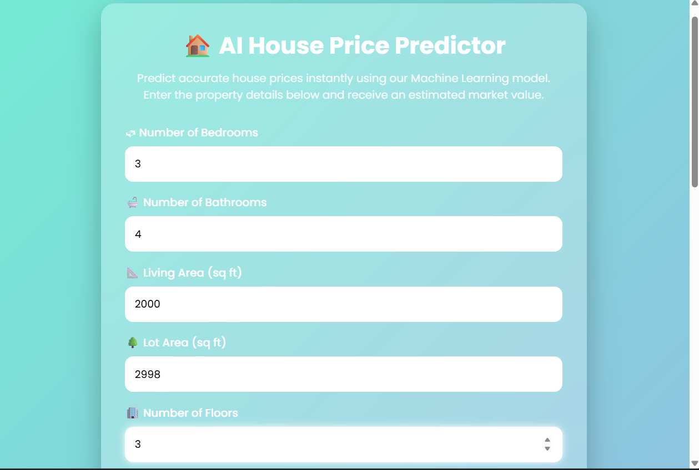

# 🏠 AI House Price Prediction

A Machine Learning web application that predicts house prices based on property features. This project is built using **Python**, **Flask**, and **Scikit-learn**.

---

## 🚀 Features

- Predicts house prices using a trained Machine Learning model.
- Simple and user-friendly web interface.
- Responsive and modern UI.
- Real-time predictions.
- Built with Flask.

---

## 🛠️ Technologies Used

- Python
- Flask
- Scikit-learn
- Pandas
- NumPy
- HTML
- CSS
- Joblib

---

## 📂 Project Structure

```
house-price-prediction/
│
├── app.py
├── train_model.py
├── model.py
├── data_processing.py
├── house_price_model.pkl
├── processed_data.csv
├── requirements.txt
├── static/
│   └── style.css
├── templates/
│   └── index.html
└── README.md
```

---

## ⚙️ Installation

1. Clone the repository

```bash
git clone <repository-url>
```

2. Navigate to the project

```bash
cd house-price-prediction
```

3. Install dependencies

```bash
pip install -r requirements.txt
```

4. Run the application

```bash
python app.py
```

5. Open your browser and visit:

```
https://ml-house-price-prediction-cuvm.onrender.com
```

---

## 📸 Application Preview

### 🏠 Home Page



### 📝 User Input Form


### 💰 Prediction Result


## 🔮 Future Improvements

- Add location-based price prediction.
- Improve prediction accuracy.
- Deploy the application online.
- Add charts and data visualization.
- Improve mobile responsiveness.

---

## 👨‍💻 Author

**Vemareddy Dharma Teja**

B.Tech – Artificial Intelligence & Machine Learning

GitHub: [Dharmateja-eng](https://github.com/Dharmateja-eng)